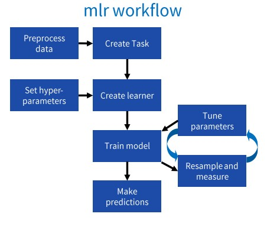

# Data Preprocessing



## Managing Data With R

1. Getting the Dataset
2. Installing and Importing Packages
3. Importing Datasets
4. Finding Missing Data
5. Encoding Categorical Data
6. Splitting Dataset into Training and Test set
7. Feature Scaling



### 1. Getting the Dataset

The collected data for a particular problem usually in the form of **CSV**.

Here are the R datasets we will use → [R Datasets](https://drive.google.com/drive/folders/1WlAfQ1c0e_ABEs9fgjdVma_3VREi9NmF?usp=sharing)📂 

### 2. Installing and Importing Packages

To perform data preprocessing, we need to import some predefined R packages stored under a directory "library".

```text
install.packages("Package Name")
library("package Name")
```

Here are some general libraries we will use.

**Dplyr** ⇒ It is used for Data Manipulation. Below are five most common functions to solve Data Manipulation challenges.

* mutate\(\) – It is used to add new variables that are functions of existing variables.
* select\(\) – It is used to choose variables according to their names.
* filter\(\)- It is used to pick cases based on their values.
* summarise\(\) – It is used for reducing multiple values into a single summary.
* arrange\(\) – It is used for changing the order/sequence of the rows.

**caTools** ⇒ It contains several basic utility functions including: moving \(rolling, running\) window statistic functions, read/write for GIF and ENVI binary files, fast calculation of AUC, LogitBoost classifier, base64 encoder/decoder.

### 3. Importing Datasets

We need to import the datasets which we have collected for our machine learning project.

```r
dataset = read.csv(file.choose(),sep =',', header = T)
```

### 4. Finding Missing Data

To check if there is any data missing.

```r
is.na() #returns TRUE if there is missing value
```

**Ways to Handle Missing Data**

By calculating mean or median : mean of row or column which contains missing value.

```r
mean(x, na.rm = TRUE)
median(x, na.rm = TRUE)
```

The function **complete.cases\(\)** returns a logical vector indicating which cases are complete.

```r
mydata[!complete.cases(mydata),]
```

The function **na.omit\(\)** returns the object with list wise deletion of missing values.

```r
#create new dataset without missing data
newdata <- na.omit(mydata) 
```

`Handling NA Imputing Using Statistics Method.`

`Handling NA Imputing Using Prediction MissForest.`

### 5. Encoding Categorical Data

Categorical data is which has some categories. Since the machine learning model completely works on mathematics and numbers, so we have to encode these categorical variables into numbers.

```r
dataset$variable = factor(dataset$variable,
                         levels = c('V1', 'V2', 'V2'),
                         labels = c(1, 2, 3))
```

### 6. Splitting Datasets into Training and Test Set

Generally we divide dataset into 80% Training and 20% Test set using **sample.split\(\)**.

```r
split = sample.split(dataset, SplitRatio = 0.8)
```

And the Training and Test set data will be

```r
training_set = subset(dataset, split == TRUE)
test_set = subset(dataset, split == FALSE)
```

### 7. Feature Scaling

This technique is used to standardize the independent features present in the data. Scaling will use the formula or/and standard deviation to scale the values.

```r
training_set = scale(training_set)
test_set = scale(test_set)
```

