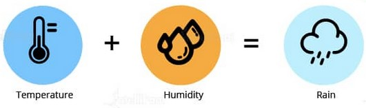
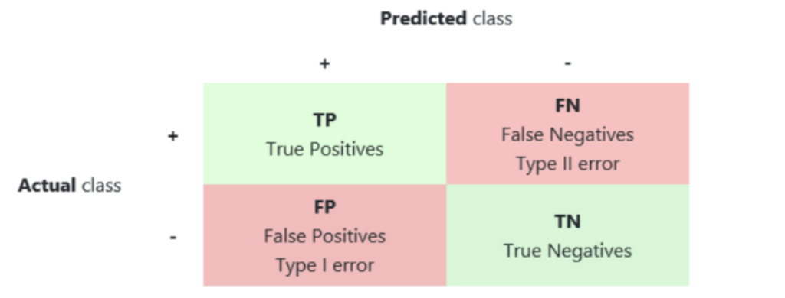

# 1. Basic

## **1. What do you understand by linear regression?**

Linear regression helps in understanding the linear relationship between the dependent and the independent variables. Linear regression is a supervised learning algorithm, which helps in finding the linear relationship between two variables. One is the predictor or the independent variable and the other is the response or the dependent variable. In Linear Regression, we try to understand how the dependent variable changes w.r.t the independent variable. If there is only one independent variable, then it is called simple linear regression, and if there is more than one independent variable then it is known as multiple linear regression.

## **2. What do you understand by logistic regression?**

Logistic regression is a classification algorithm which can be used when the dependent variable is binary.

Let’s take an example. Here, we are trying to determine whether it will rain or not on the basis of temperature ****and Humidity.

Temperature and humidity are the independent variables, and rain would be our dependent variable.

## **3. What is a confusion matrix?**

Confusion matrix is a table which is used to estimate the performance of a model. It tabulates the actual values and the predicted values in a 2×2 matrix.

* **True Positives :-** The actual values are true and the predicted values are also true.
* **False Negatives :-** The actual values are true, but the predicted values are false.
* **False Positives :-** The actual values are false, but the predicted values are true.
* **True Negatives :-** The actual values are false and the predicted values are also false.

To get the correct values, then correct values would basically represent all the true positives and the true negatives.

