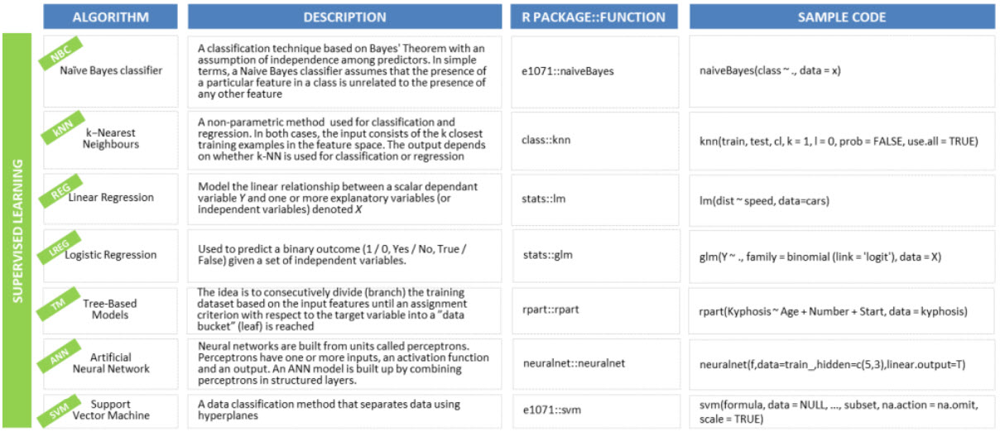

# Classification



### 1. K-Nearest Neighbors

It is a supervised classification technique that uses proximity as a proxy for ‘**sameness**’. The algorithm takes a bunch of labelled points and uses them to learn how to label other points. To label a new point, it looks at the labelled points closest to that new point \(those are its nearest neighbors\). Closeness is typically expressed in terms of a dissimilarity function. Once it checks with ‘k’ number of nearest neighbors, it assigns a label based on whichever label the most of the neighbors have.




```r
# Importing the dataset
dataset= read.csv(file.choose())
dataset = dataset[,3:5]

# Encoding the target feature as factor
dataset$Purchased = factor(dataset$Purchased,
                           levels = c(0, 1))

# Splitting the dataset into the Training set and Test set
# install.packages('caTools')
library(caTools)
set.seed(123)

split = sample.split(dataset$Purchased,
                     SplitRatio = 0.75)
                     
training_set = subset(dataset, split == TRUE)
test_set = subset(dataset, split == FALSE)

# Feature scale

training_set[-3] = scale(training_set[-3])
test_set[-3] = scale(test_set[-3])

# Fitting K-NN to the Training set and Predicting the Test set results
library(class)
y_pred = knn(train = training_set[, -3],
             test = test_set[, -3],
             cl = training_set[, 3],
             k = 5,
             prob = TRUE)

# Making the Confusion Matrix
cm = table(test_set[, 3], y_pred)
cm

#Predicting whether the person whose ag is 20 and sal is 20000
#will belong to class 0 or class 1

x=data.frame(Age=20,EstimatedSalary=20000) 
summary(x)

check=knn(train = training_set[, -3],
          test = x,
          cl = training_set[, 3],
          k = 5)
```



### 2. Naive Bayes

A Naive Bayes classifiers assume that the presence of a particular feature in a class is unrelated to the presence of any other feature or that all of these properties have independent contribution to the probability.

Naive Bayes is known to outperform even **highly sophisticated** classification methods.




```r
# Importing the dataset 
dataset = read.csv(file.choose()) 
dataset = dataset[,3:5] 
str(dataset) 

# Encoding the target feature as factor 
dataset$Purchased = factor(dataset$Purchased,  
                           levels = c(0, 1)) 
str(dataset) 

# Splitting the dataset into the Training set and Test set 
install.packages('caTools') 
library(caTools) 
set.seed(123) 

split = sample.split(d7$Purchased,  
                     SplitRatio = 0.75) 
                     
training_set = subset(d7, split == TRUE) 
test_set = subset(d7, split == FALSE) 

# Feature Scaling 
training_set[-3] = scale(training_set[-3]) 
test_set[-3] = scale(test_set[-3]) 

# Fitting SVM to the Training set 
install.packages('e1071') 
library(e1071) 
classifier = naiveBayes(x = training_set[-3], 
                        y = training_set$Purchased) 

# Predicting the Test set results 
y_pred = predict(classifier, newdata = test_set[-3]) 
y_pred 


# Making the Confusion Matrix 
cm = table(test_set[, 3], y_pred) 
cm

```



### 3. Decision Tree

Decision tree builds classification or regression models in the form of a tree structure. It breaks down a data set into smaller and smaller subsets while at the same time an associated decision tree is incrementally developed.

A decision node has two or more branches and a leaf node represents a classification or decision. Decision trees can handle both **categorical and numerical data.**




```r
# Importing the dataset
#dataset = read.csv('Social_Network_Ads.csv')
dataset = read.csv(file.choose())
dataset = dataset[3:5]

# Encoding the target feature as factor
dataset$Purchased = factor(dataset$Purchased, levels = c(0, 1))

# Splitting the dataset into the Training set and Test set
install.packages('caTools')
library(caTools)
set.seed(123)

split = sample.split(dataset$Purchased, SplitRatio = 0.75)

training_set = subset(dataset, split == TRUE)
test_set = subset(dataset, split == FALSE)

# Feature Scaling
training_set[-3] = scale(training_set[-3])
test_set[-3] = scale(test_set[-3])

View(training_set)

# Fitting Decision Tree Classification to the Training set 
install.packages('rpart') 
library(rpart) 

classifier = rpart(formula = Purchased ~ ., 
                   data = training_set) 

# Predicting the Test set results 
y_pred = predict(classifier, newdata = test_set[-3] ) 
y_pred 

y_pred = predict(classifier, newdata = test_set[-3],  
                 type = 'class') 
y_pred 


# Making the Confusion Matrix 
cm = table(test_set[, 3], y_pred) 
cm 

#Accuracy in the form of percentage
library(scales)
accuracy = percent((53+30)/100)

# Plotting the tree 
plot(classifier) 
text(classifier)
```


