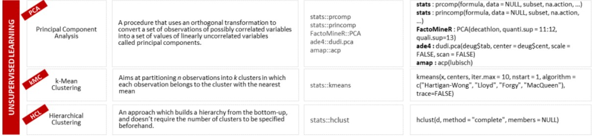

# Clustering and Pattern Detection




### 1. K-Means Clustering







```r
# Importing the dataset
#dataset = read.csv('Mall_Customers.csv')
dataset=read.csv(file.choose())
dataset = dataset[4:5]

# Splitting the dataset into the Training set and Test set
# install.packages('caTools')
# library(caTools)
# set.seed(123)
# split =sample.split(dataset$DependentVariable,SplitRatio = 0.8)
# training_set = subset(dataset, split == TRUE)
# test_set = subset(dataset, split == FALSE)

# Feature Scaling
# training_set = scale(training_set)
# test_set = scale(test_set)

# Using the elbow method to find the optimal no. of clusters
set.seed(6)
wcss = vector()   #empty vector
for (i in 1:10) wcss[i] = sum(kmeans(dataset, i)$withinss)
plot(1:10,
     wcss,
     type = 'b',
     main = paste('The Elbow Method'),
     xlab = 'Number of clusters',
     ylab = 'WCSS')

# Fitting K-Means to the dataset
set.seed(29)
kmeans = kmeans(x = dataset, centers = 5,
                iter.max=500)
y_kmeans = kmeans$cluster
y_kmeans

x= kmeans$cluster
x
getwd()
write.csv(x,"cluser.csv")

# Visualising the clusters
#install.packages("cluster")
library(cluster)
clusplot(dataset,
         y_kmeans,
         lines = 0,
         shade = TRUE,
         color = TRUE,
         labels = 2,
         plotchar = FALSE,
         span = TRUE,
         main = paste('Clusters of customers'),
         xlab = 'Annual Income',
         ylab = 'Spending Score')
```



### 2. Hierarchical Clustering




```r
# Importing the dataset
#dataset = read.csv('Mall_Customers.csv')
dataset= read.csv(file.choose())
dataset = dataset[4:5]

# Splitting the dataset into the Training set and Test set
# install.packages('caTools')
# library(caTools)
# set.seed(123)
# split=sample.split(dataset$DependentVariable,SplitRatio = 0.8)
# training_set = subset(dataset, split == TRUE)
# test_set = subset(dataset, split == FALSE)

# Feature Scaling
# training_set = scale(training_set)
# test_set = scale(test_set)

# Using the dendrogram to find the optimal number of clusters
dendrogram = hclust(d = dist(dataset, 
             method = 'euclidean'), 
             method = 'ward.D')
plot(dendrogram,
     main = paste('Dendrogram'),
     xlab = 'Customers',
     ylab = 'Euclidean distances')

# Fitting Hierarchical Clustering to the dataset
hc = hclust(d = dist(dataset, method = 'euclidean'), 
            method = 'ward.D')
y_hc = cutree(hc, 2)

# Visualising the clusters
library(cluster)
clusplot(dataset,
         y_hc,
         lines = 0,
         shade = TRUE,
         color = TRUE,
         labels= 2,
         plotchar = FALSE,
         span = TRUE,
         main = paste('Clusters of customers'),
         xlab = 'Annual Income',
         ylab = 'Spending Score')
```



### 3. Market Basket Analysis Using Association Rules





```r
install.packages('arules')
library(arules)
dataset = read.csv('Market_Basket_Optimisation.csv', header = FALSE)

dataset = read.transactions('Market_Basket_Optimisation.csv', sep = ',', rm.duplicates = TRUE)

summary(dataset)

itemFrequencyPlot(dataset, topN = 10)

# Training Apriori on the dataset
rules = apriori(data = dataset, parameter = list(support = 0.003, confidence = 0.2))

# Visualising the results
inspect(sort(rules, by = 'lift')[1:10])
```



